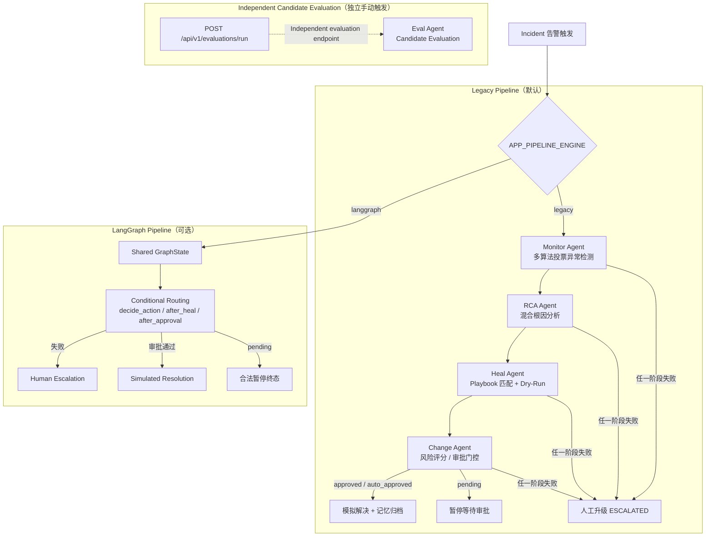

# AIOps Agent Platform

一个**受控模拟环境下的多 Agent 故障诊断原型**：接收告警或自然语言故障描述，由多个专业 Agent 协作完成异常检测、混合根因分析、Dry-Run 恢复规划、风险审批与记忆归档，并附带一套候选评测（Candidate Evaluation）框架。

> 这是一个技术演示项目，不是生产自愈系统。所有"修复"均为 Dry-Run 模拟，基础设施数据来自内置的模拟数据集。

## 30 秒了解这个项目

| 问题 | 回答 |
|------|------|
| 解决什么问题 | 演示"告警 → 根因 → 恢复方案 → 审批 → 经验沉淀"这条 AIOps 诊断链路如何用多 Agent + 规则/LLM 混合推理实现 |
| 输入是什么 | 结构化告警事件（`POST /api/v1/incidents/trigger`），或自然语言故障描述（`POST /api/v1/incidents/diagnose`，如"为什么下单这么慢？"） |
| Agent 做什么 | Monitor 多算法投票检测异常 → RCA 融合拓扑/贝叶斯/知识库/历史记忆定位根因 → Heal 匹配 Playbook 并做 Dry-Run 与爆炸半径评估 → Change 五因素风险评分决定自动批准或挂起等待人工 |
| 输出是什么 | 故障状态机全程流转记录（WebSocket 实时推送）：根因假设与置信度、Dry-Run 恢复计划、风险评分与审批结论、归档到记忆系统的诊断经验 |
| 边界在哪 | 受控模拟原型：不触碰真实基础设施、不执行真实修复；LLM 是可选增强，默认走纯规则路径 |

## 一个开关、两种执行引擎

`POST /api/v1/incidents/trigger` 的后台处理引擎由环境变量 `APP_PIPELINE_ENGINE` 决定（`/ready` 的 `checks.langgraph.engine` 会如实报告当前配置）：

1. **`legacy`（默认）— 手写顺序管道**：[`routes.py`](backend/app/api/routes.py) 的 `_process_incident_pipeline`——Monitor → RCA → Heal(Dry-Run) → Change 依次执行，任一阶段失败转人工升级（ESCALATED），审批 `pending` 暂停后可经 `POST /api/v1/incidents/{id}/approve|reject` 人工恢复。
2. **`langgraph` — LangGraph 状态机**：[`orchestrator.py`](backend/app/agents/orchestrator.py) 的条件路由状态机（含人工升级、pending 暂停终态、模拟解决），经 `Orchestrator.process_alert()` 承接同一个已注册的 Incident，WebSocket 状态推送通过回调注入。LangGraph 依赖缺失时运行期自动回落 legacy。

两种引擎的已知差异（如实声明）：langgraph 引擎不含 Monitor 异常确认阶段（receive_alert → triage 直接进 RCA），不写入记忆系统，事件字段挂载与终态语义（RESOLVED / AWAITING_APPROVAL / ESCALATED）与 legacy 一致，另会在 `context` 里附加 `orchestrator.*` 的各节点产物。

Candidate Evaluation 不会在 Incident Pipeline 结束后自动运行；需要通过独立的 `POST /api/v1/evaluations/run` 端点手动触发。

## 架构图



## 核心技术亮点与代码入口

| 技术点 | 实现要点 | 代码入口 |
|--------|----------|----------|
| Agent 统一执行包装 | 泛型 `BaseAgent[TInput, TOutput]`，`asyncio.wait_for` 超时控制，统一成功/失败/超时语义与状态记录 | [`backend/app/agents/base.py`](backend/app/agents/base.py) |
| 多算法异常检测 | 3-Sigma / EWMA / sklearn Isolation Forest 三算法投票共识，训练样本不足时回退 MAD；告警指纹去重 | [`backend/app/agents/monitor_agent.py`](backend/app/agents/monitor_agent.py) |
| 混合根因分析 | BFS 拓扑依赖遍历 + 贝叶斯后验推理 + 知识库检索 + 历史记忆，多路证据融合 | [`backend/app/agents/rca_agent.py`](backend/app/agents/rca_agent.py) |
| LLM 结构化输出约束 | `structured_completion`：Pydantic Schema 校验 + 闭集候选校验回调，校验失败把错误喂回模型自修复重试，耗尽抛 `LLMUnavailableError` | [`backend/app/services/llm_service.py`](backend/app/services/llm_service.py) |
| LLM 不可用规则降级 | RCA / NLU / Judge 三处各自闭环降级到规则路径，`LLMUnavailableError` 不冒泡到 API 层 | [`backend/app/agents/rca_agent.py`](backend/app/agents/rca_agent.py) · [`backend/app/nlu/hybrid.py`](backend/app/nlu/hybrid.py) |
| Dry-Run 恢复规划 | Playbook 匹配、逐动作 Dry-Run 模拟、爆炸半径评估、L0/L1/L2 分级自愈、熔断器保护 | [`backend/app/agents/heal_agent.py`](backend/app/agents/heal_agent.py) |
| 风险评分与审批门控 | 五因素加权风险评分（爆炸半径/历史成功率/时间因素/服务等级/变更类型），分级审批与审计日志 | [`backend/app/agents/change_agent.py`](backend/app/agents/change_agent.py) |
| LangGraph 条件状态机 | `StateGraph` + 条件边路由：失败升级 / pending 暂停 / 审批通过验证，终态与 incident 状态一致性校验 | [`backend/app/agents/orchestrator.py`](backend/app/agents/orchestrator.py) |
| 三层记忆系统 | 短期/长期/工作记忆流转与归档，ChromaDB 嵌入式/独立服务双模式向量检索 | [`backend/app/memory/core.py`](backend/app/memory/core.py) |
| Candidate Evaluation | 端到端/推理/工具调用/RAG 四维度规则指标，可选 LLM-as-Judge 融合（规则分 0.6 + Judge 分 0.4） | [`backend/app/agents/eval_agent.py`](backend/app/agents/eval_agent.py) |
| NLU 快慢路径 | 正则快路径 + LLM 慢路径（置信度阈值切换），自然语言 → 意图/实体/诊断计划 | [`backend/app/nlu/hybrid.py`](backend/app/nlu/hybrid.py) |

## 最小演示流程

以本地开发模式启动后端后（见下文 Local verification）：

```bash
# 1. 触发一次结构化告警，走完整 Agent 管道
curl -X POST http://localhost:8000/api/v1/incidents/trigger \
  -H "Content-Type: application/json" \
  -d '{"source":"demo","service":"order-service","metric":"cpu_usage_percent","value":95.0,"threshold":80.0,"operator":">","severity":"critical"}'

# 2. 用返回的 incident_id 查询处理进度（管道在后台异步执行）
curl http://localhost:8000/api/v1/incidents/<incident_id>

# 3. 或者用自然语言触发诊断
curl -X POST http://localhost:8000/api/v1/incidents/diagnose \
  -H "Content-Type: application/json" \
  -d '{"query":"为什么下单这么慢？"}'
```

处理结果包含根因假设、Dry-Run 恢复计划、风险评分与审批状态；WebSocket 同步推送状态流转。

## Local verification（本地验证）

> 命名为 Local verification 而非 Quick Start：以下命令基于当前代码与已验证记录；完整的一键端到端启动体验未在通用环境做过验证。

**后端测试（干净克隆已验证）**：

```bash
cd backend
python3.11 -m venv .venv && source .venv/bin/activate
pip install -r requirements.txt
pytest -q
ruff check app
```

**前端质量检查与构建**：

```bash
cd frontend
npm ci
npm run lint
npm run build
```

注意：Compose 默认值已使用 JSON 字符串数组；如果创建 `backend/.env` 并自定义 CORS，也必须使用相同格式（逗号分隔字符串会导致 pydantic-settings 解析 list 字段失败）：

```text
APP_CORS_ORIGINS=["http://localhost:3000"]
```

**本地开发模式运行后端**：

```bash
cd backend
cp .env.example .env   # 可选；不填 LLM Key 即为纯规则模式
uvicorn app.main:app --reload
```

**Docker 构建（干净克隆已验证 backend 镜像构建）**：

```bash
docker compose build backend
docker compose up -d   # backend :8000 / frontend :8080
```

说明：

- `docker-compose.yml` 默认 `APP_ENV=production`；`/docs`、`/redoc` 与 `/openapi.json` 仅在 `APP_ENV=development` 时开放，生产环境关闭。
- Chroma 支持双模式：本地开发未设置 `CHROMA_HOST` 时使用嵌入式 `PersistentClient`；Compose 已设置 `CHROMA_HOST=chroma`，后端会通过 `HttpClient` 连接独立 Chroma 服务。
- 当前主 LLM 配置读取 `LLM_API_KEY` / `LLM_PROVIDER` / `LLM_MODEL`；Compose 保留的 `OPENAI_API_KEY` / `DEEPSEEK_API_KEY` 兼容透传项不会被当前主 `LLMService` 自动读取。Compose 不透传 `LLM_ENABLE_RCA/NLU/JUDGE` 功能开关——只填 Key 不会自动启用全部 LLM 功能。

## Rule-only 与 Optional LLM 模式

LLM 是**可选增强能力**，默认关闭，系统在纯规则模式下即可完整跑通全流程：

| 开关 | 默认 | 作用 | 降级行为 |
|------|------|------|----------|
| （不设 `LLM_API_KEY`） | 空 | 全局禁用 LLM 客户端 | 全部走规则路径 |
| `LLM_ENABLE_RCA` | `false` | RCA 多路证据 LLM 融合推理 | 规则综合（贝叶斯+RAG+记忆）兜底 |
| `LLM_ENABLE_NLU` | `false` | 自然语言理解慢路径 | 正则快路径兜底 |
| `LLM_ENABLE_JUDGE` | `false` | 评测 LLM-as-Judge | 纯规则指标评分 |

所有 LLM 输出经 `structured_completion` 做 Schema 校验与闭集候选校验（根因/服务名只能从系统给出的候选列表中选择），校验失败自动把错误反馈给模型重试；LLM 不可用抛 `LLMUnavailableError` 并降级规则路径，不影响 API 可用性。

## 能力边界（如实声明）

1. HTTP API 默认执行手写顺序管道；LangGraph 状态机经 `APP_PIPELINE_ENGINE=langgraph` 可承接 HTTP 请求，但不含 Monitor 阶段、不写记忆系统（见上文两引擎差异）。
2. Heal Agent 只生成 Playbook 匹配结果、Dry-Run 模拟与风险评估，不对任何真实基础设施执行修复。
3. 审批 `pending` 暂停后可经 `POST /api/v1/incidents/{id}/approve|reject` 人工恢复（approve 补跑模拟收尾，reject 转人工升级）。
4. Chroma 支持双模式：默认嵌入式 `PersistentClient` 本地持久化；设置 `CHROMA_HOST` 后切换 `HttpClient` 连接独立服务（docker-compose 已把后端指向 chroma 容器）。
5. 服务拓扑、指标数据、故障场景、业务事件均来自内置模拟数据集（[`backend/app/data/`](backend/app/data/)）。
6. 本项目不声称生产可用，不声称降低真实 MTTR，不声称实现线上自动自愈。

## Demo / Synthetic Data 声明

以下数据为演示或合成数据，非真实系统采集：

- 故障场景、指标时序、服务拓扑、知识库与 Playbook：内置数据集（[`backend/app/data/datasets.py`](backend/app/data/datasets.py)、[`backend/app/data/knowledge_base.py`](backend/app/data/knowledge_base.py)、[`backend/app/data/playbooks.py`](backend/app/data/playbooks.py)）。
- `/api/v1/topology` 中节点健康状态为预设演示值；节点 CPU/内存/延迟取自内置模拟数据集的 normal 场景（数据层节点无数据集时如实返回 null）。
- 前端仪表盘的初始 incident 与统计数据为预置演示状态（[`frontend/src/store/useAppStore.ts`](frontend/src/store/useAppStore.ts)）。
- 演示故障数据（7 条预置事故）由 `APP_ENABLE_DEMO_SEED` 开关控制，默认关闭：开启后启动时自动注入，`/api/v1/incidents/seed-demo` 端点亦可手动触发；关闭时端点返回 403。`docker-compose.dev.yml` 演示栈显式开启。

## Candidate Evaluation 说明

[`eval_agent.py`](backend/app/agents/eval_agent.py) 实现了四维度（端到端 / 推理 / 工具调用 / RAG）评测框架，指标包括根因准确率、置信度校准、检索精确率等，并支持可选的 LLM-as-Judge 对推理链做融合评分（可配置独立 `judge_model` 防同源偏置）。评测通过独立的 `POST /api/v1/evaluations/run` 端点手动触发，不是 Incident Pipeline 的自动下游步骤。

定位说明：这是 **Candidate Evaluation（候选评测）**——在内置模拟场景与默认测试集上运行的候选指标，用于演示评测方法论，不是 Accepted Baseline，不构成对系统真实效果的验收结论。

## 测试验证证据

```text
Full-suite verification (2026-07-15, 全景地图问题修复轮之后):
402 passed / 1 skipped / 0 failed
Backend Docker image build: passed
Runtime data module import: passed
```

以上为在该次验证日期由当前依赖约束解析出的环境中完成的一次干净克隆验证，用于证明仓库自洽可构建、测试套件全绿；不代表生产 SLA 或线上质量承诺。

## 项目结构

```text
aiops-agent-platform/
├── backend/
│   ├── app/
│   │   ├── agents/          # Monitor / RCA / Heal / Change / Eval / Orchestrator
│   │   ├── api/             # REST 路由（含 HTTP 顺序管道）/ WebSocket / Webhook
│   │   ├── data/            # 内置模拟数据集、知识库、Playbook
│   │   ├── evaluation/      # 四维度评测框架与指标
│   │   ├── memory/          # 三层记忆系统 + ChromaDB 双模式存储
│   │   ├── nlu/             # 意图识别 / 实体抽取 / 指标映射 / 快慢路径
│   │   ├── services/        # LLM 服务 / Langfuse / Incident 服务
│   │   ├── config.py        # pydantic-settings 分组配置
│   │   └── main.py          # FastAPI 入口与生命周期
│   ├── tests/               # 全量测试套件
│   └── .env.example         # 本地开发环境变量模板
├── frontend/                # React 18 + TypeScript + Vite 仪表盘
├── docker-compose.yml       # 生产编排（APP_ENV=production）
├── docker-compose.dev.yml   # 开发编排（含 Prometheus 等可观测性组件）
└── .env.example             # Docker 部署环境变量模板
```

## 技术栈

- **后端**：Python 3.11 · FastAPI · Uvicorn · Pydantic v2 · structlog
- **Agent 编排**：手写顺序管道（默认引擎）· LangGraph 状态机（`APP_PIPELINE_ENGINE=langgraph` 切换）
- **算法**：NumPy · scikit-learn（Isolation Forest）· 贝叶斯推理 · BFS 拓扑遍历
- **LLM（可选）**：OpenAI 兼容 SDK（OpenAI / DeepSeek），结构化输出 + 规则降级
- **存储**：ChromaDB（嵌入式 PersistentClient / 独立 HttpClient）· SQLite
- **可观测性**：Prometheus 指标 · Langfuse 埋点（可选）
- **前端**：React 18 · TypeScript · Vite · Tailwind CSS · Zustand
- **测试 / 部署**：pytest · pytest-asyncio · Docker · Docker Compose

## License

[MIT](LICENSE) © 2026 Steven2001-LI
